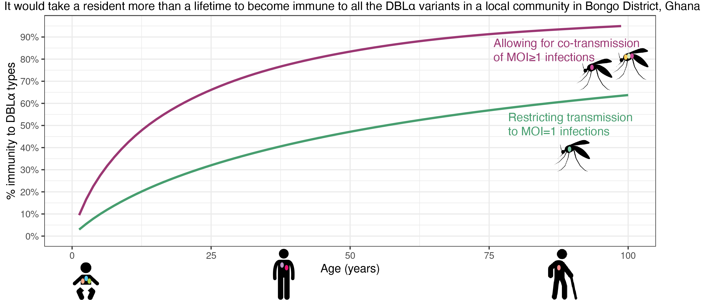

During my PhD I investigated the genetic epidemiology of the malaria parasite *Plasmodium falciparum* in Bongo District, Ghana and discovered that residents of all ages harbored infections that were genetically diverse and structured to ensure lifelong carriage of parasites. The findings from my PhD have supported the development of a novel malaria surveillance tool called the "*var*code" that can be applied to genetically fingerprint parasites based on variant antigen genes.

Below is a graphical abstract from one of the publications from the major findings of my thesis. This manuscript is accepted in International Journal for Parasitology.

